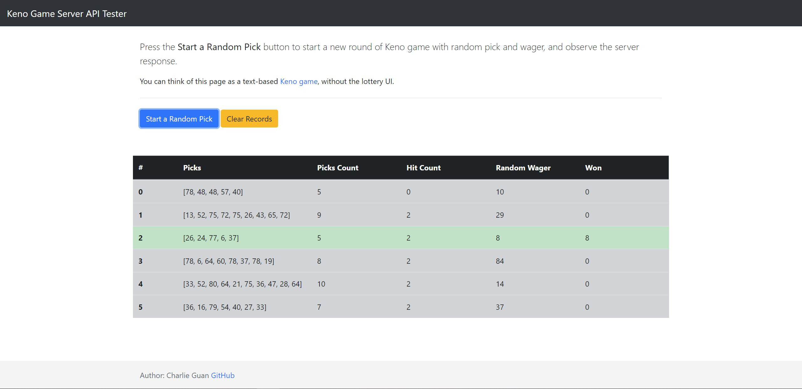

# Keno Server
A simple server for a Keno lottery game, built using ExpressJS. Comes with an AngularJS front-end to test the API.

You can view this application live on [https://keno-server.azurewebsites.net/](https://keno-server.azurewebsites.net/)


# Build & Run
Follow these steps if you want to run the server on your own machine locally.
## Build
1. Make sure you have NodeJS, npm, and git installed; execute these commands in a terminal.
1. `git clone https://github.com/charliegdev/keno-server.git`
1. `cd keno-server`
1. `npm install`

The source code is ready. Check out the next section on how to launch the server and see it in action.

## Run
There are 2 ways to run this:
1. For prod server, run `npm start`.
1. For dev server, run `npm run nodemon`. This would start `nodemon`, which automatically restarts the NodeJS server whenever we make changes to the source code.

Go to [http://localhost:3000](http://localhost:3000) to see the Keno server API tester page.

### [Optional] Babel for Front-end JavaScript
If you don't plan to change any of the front-end JavaScript code under the `public/es6` folder, you can skip this section.

However, if you do plan to do so, launch another terminal and run

`npm run babel`

That command will run `babel` in *watch* mode, and convert front-end ES6 code into ES5 anytime you make any change. If you don't plan to modify any front-end code, you don't need to run `babel`. Check the **Structure** section for more information about front-end code structure.

The server side code uses ES6 as well; as long as you have a reasonably up-to-date LTS version for Node.js (newer than 5.12), you should be fine without Babel.

## Use
Once the server is launched, [http://localhost:3000](http://localhost:3000) will show the front-end test page for the server.

Press the blue "Start a Random Pick" button to generate:
  * 5 - 10 random numbers between 1 and 80;
  * A random wager between 1 and 100.

After that, these things happen automatically behind the scene:

1. The client sends the information to the back-end server using the `races` endpoint. The naming of the endpoint mimics Keno Caveman.
1. The server does the calculation, and returns the result to the front-end.
1. Once the front-end gets the result, it'll display the result in the table. Gray rows mean you didn't win any money; green rows mean you did.

The front-end is basically a text-based Keno game without the lottery UI; it mimics the gameplay of Keno Caveman, without the egg mechanism. It uses the pay table in Caveman as well.

## Structure
This Express application is created using [Express Application Generator](https://expressjs.com/en/starter/generator.html). Here is a breakdown of the codebase structure:
* `bin`: the config folder for the server; NodeJS uses `bin/www` to launch the server.
* `keno-math`: gameplay related logic; separated from any Express logic. Winnings are calculated here.
* `routes`: Express-related logic to handle user's API calls. Right now it only handles `races` call; it delicates the actual gameplay calculation to modules in `keno-math`.
* `public`: front-end for the server done by AngularJS and Bootstrap 4. This front-end is included as a convenient way to test the server, but it's not required for the server's functionality. In a real environment, this `public` folder can be the location where we put the real game client.
  * `public/es6`: Source file for ECMAScript 2016. 
  * `public/dist`: Transpiled file generated by Babel. This file is referenced in `index.html`.

*Express Application Generator* generates a `views` folder by default, with `pug` as the template language. However, since I already made a single-page front-end app in AngularJS, the `views` folder is not needed, therefore removed.

## Response Structure
A response to a `races` contains a JSON which looks like this:

```javascript
{
  "data": {
    "draw": {
      "created": "2018-07-01T01:37:46.894Z",
      "hit_count": 1,
      "id": "ae56e13e-7183-4310-a1bb-544ceb7aec02",
      "reward": 0,
      "spots_count": 5,
      "spots_drawn": [77,37,27,40,6,79,2,72,48,38,17,53,45,19,58,69,71,49,8,59],
      "spots_played": [23,7,30,48,33], 
      "wager": 7
    },
    "id": "ae56e13e-7183-4310-a1bb-544ceb7aec02",
    "reward_key": "5a44cf0c-c98d-40ba-8ce8-da3a3855eb38",
    "wager": 7,
    "winner": false
  },
  "type": "basicKeno#play"
}
```

It was structured that way specifically to mimic real responses in Keno Caveman.

# Defects and Todos
Please see the "Project" section of this repo on GitHub.